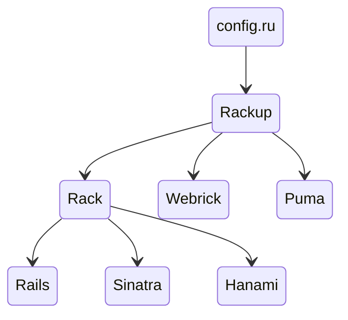
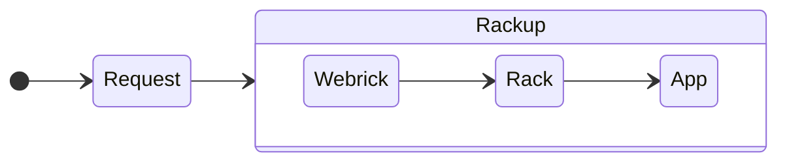
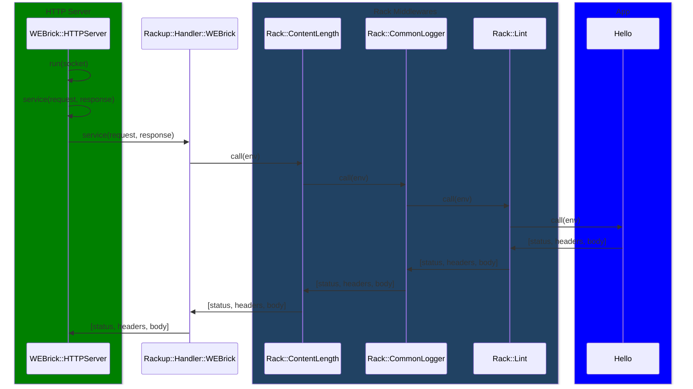
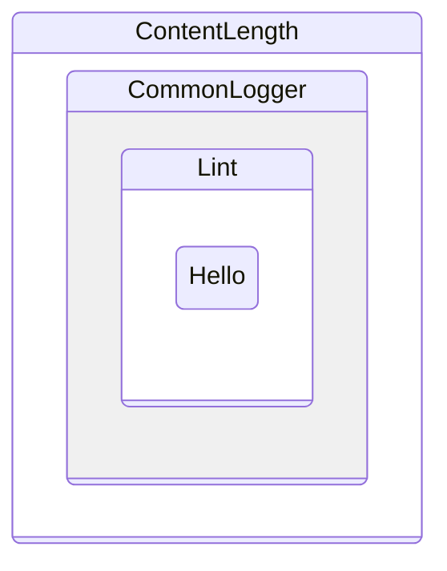

# Rack: The Swiss Army Knife of Ruby Web Servers

## What is Rack?

Rack provides a minimal, modular, and adaptable interface for developing web applications in Ruby. It serves as a standard interface between web servers and web applications, allowing developers to use different web servers and frameworks seamlessly.

## Rack App

To run an app service with Rack, you can use the `rackup` command, which is a powerful tool for starting web services. Here's how you can implement a simple web service:

```ruby
class Hello
  def call(env)
    [200, {"Content-Type" => "text/html"}, ["Hello there!"]]
  end
end
```

Save this code in a file, let's say `config.ru`, and then you can start the server with `rackup`.

### Rack App Structure

Here's a visual representation of how the components interact with each other:



## Data Flow

The data flow in a Rack application is straightforward:



## Call Sequence

The sequence of a request handling in a Rack application:



## Boot up

The boot-up process involves several steps, starting from `Rackup::Server.start` to building the application stack using middleware.

## Run the app

The `Rack::Builder#run` method is used to run the application:

```ruby
Rack::Builder#run(app=#<Hello:0x000000011e0d49d0>, block=nil)
```

## App Russian Doll

Rack applications can be nested with middleware, creating a "Russian doll" structure:

```ruby
def build_app(app)
  middleware[options[:environment]].reverse_each do |middleware|
    klass, *args = middleware
    app = klass.new(app, *args)
  end
  app
end
```

## Middleware

Middleware in Rack can be visualized as a series of layers:



### Default Middleware

Rack comes with a set of default middleware that can be used in different environments:

```ruby
def default_middleware_by_environment
  m = Hash.new {|h, k| h[k] = []}
  m["deployment"] = [
    [Rack::ContentLength],
    logging_middleware,
    [Rack::TempfileReaper]
  ]
  m["development"] = [
    [Rack::ContentLength],
    logging_middleware,
    [Rack::ShowExceptions],
    [Rack::Lint],
    [Rack::TempfileReaper]
  ]
  m
end
```

## Server

The server can be configured and started using the `Rackup::Handler`:

```ruby
def server
  @_server ||= Handler.get(options[:server]) || Handler.default
end
```

And the `WEBrick` class is used to handle the server-side operations:

```ruby
module Rackup
  module Handler
    class WEBrick < ::WEBrick::HTTPServlet::AbstractServlet
      def self.run(app, **options)
        ...
        @server = ::WEBrick::HTTPServer.new(options)
        @server.mount "/", Rackup::Handler::WEBrick, app
        yield @server if block_given?
        @server.start
      end
    end
  end
end
```

## Conclusion

Rack, with its simple and flexible design, allows developers to build web applications in Ruby with ease. Whether you're using Rails, Sinatra, or any other framework, Rack provides a consistent interface for handling requests and responses. The ability to chain middleware and the simplicity of setting up a web server make Rack an indispensable tool in the Ruby web developer's toolbox.

