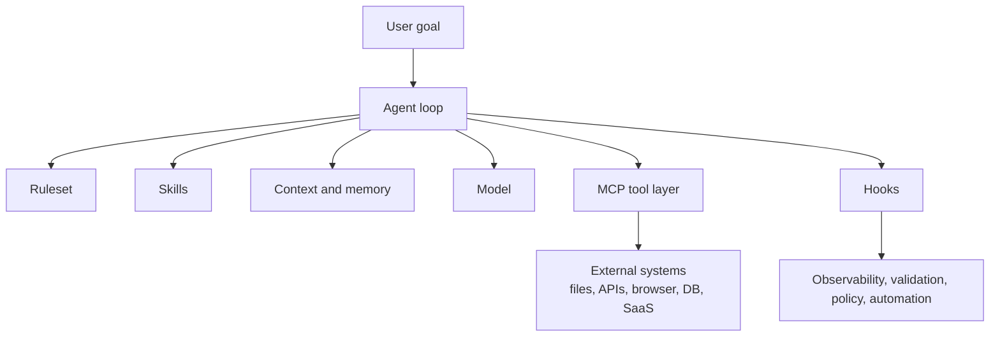
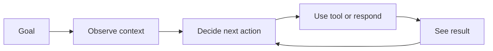
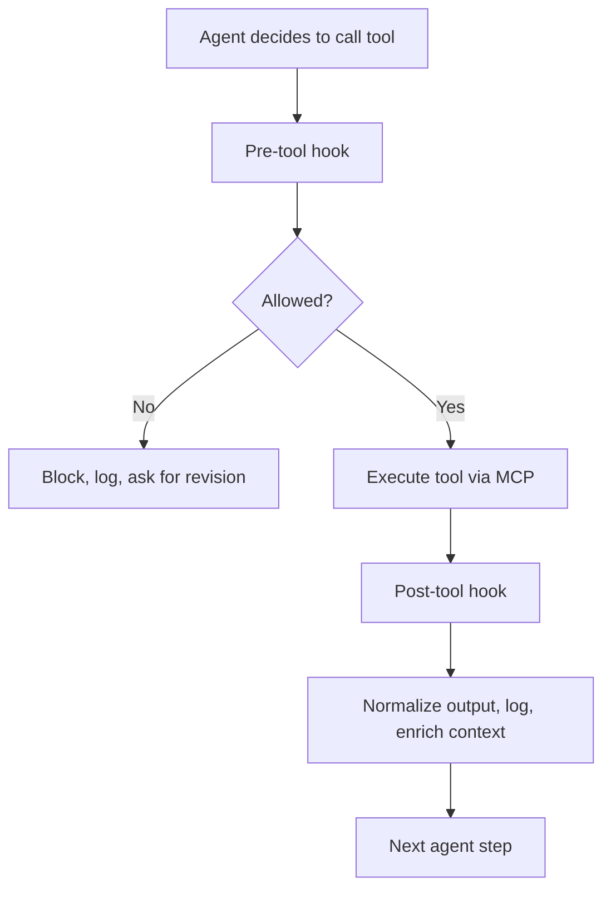
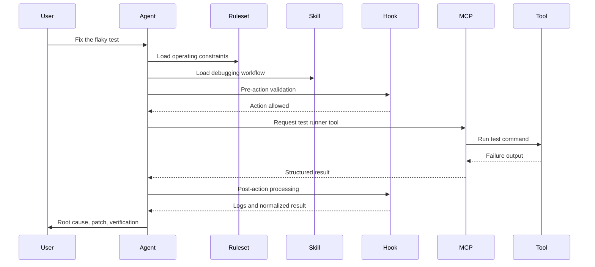
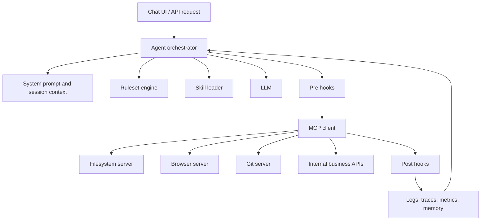

# MCP, Skills, Agents, Rulesets, and Hooks: A Practical Map for AI Development

In the earlier articles in this series, I focused on the big shifts:

- LLMs are components, not complete applications
- context has become a primary engineering surface
- AI systems behave more like ecosystems than static software
- developers are moving from pure implementation toward orchestration

Once you accept that framing, a more practical question shows up:

> **What are the actual moving parts in a modern AI development environment?**

That is where terms like MCP, skills, agents, rulesets, and hooks start showing up.

If you spend enough time around AI coding tools, you start hearing the same words over and over:

- MCP
- skills
- agent
- ruleset
- hooks
- tools
- memory
- context

At first they sound like overlapping jargon. In practice, they are not the same thing at all. They solve different problems at different layers.

That distinction matters because a lot of AI systems feel messy for one simple reason: teams mix up the layers. They use prompts where they need policy. They use agents where a tool call would do. They push workflow logic into the model when it should live in hooks or system code.

This article is a companion map for that stack.

The goal is not to make the stack sound more impressive. The goal is to make it easier to reason about what belongs where.

---

## The short version

Here is the practical mental model:

- **Model**: generates text, plans, and decisions
- **Agent**: wraps the model in a loop so it can observe, decide, act, and continue
- **Skills**: reusable task recipes and domain-specific instructions
- **Ruleset**: boundaries and operating policy
- **MCP**: a standard way for the agent to talk to tools and external systems
- **Hooks**: code that runs at specific lifecycle moments to validate, transform, log, or block actions

If you only remember one thing, remember this:

> **An AI application is not just a model. It is a governed execution loop.**

---

## The stack at a glance



This diagram is deliberately simple.

The point is not that the agent "contains" everything in a literal implementation sense. The point is that the agent is the place where all these pieces meet.

---

## Start with the agent, not the model

Most people begin with the model because that is the flashy part. But when you build real systems, the more useful unit is the **agent**.

The model is the reasoning engine. The agent is the operating pattern around it.

### What a model does

A model:

- reads input
- predicts the next tokens
- follows instructions
- decides whether to call tools if the framework allows it

That is useful, but limited.

### What an agent adds

An agent usually adds a loop like this:

1. read the goal
2. inspect available context
3. decide whether to answer directly or act
4. call a tool or another subsystem
5. observe the result
6. continue until done

That is why "agent" is a meaningful term. It is not just a branding upgrade for "chatbot." It means the system can take multiple steps instead of producing a single response and stopping.



If your system only takes one prompt and returns one answer, you may have an AI feature. You do not really have an agent yet.

---

## What MCP is actually for

MCP usually gets described too vaguely. A cleaner definition is this:

> **MCP is the connection layer that lets models and agents use external capabilities in a structured way.**

MCP stands for **Model Context Protocol**. The important part is not the acronym. The important part is the role it plays.

Without something like MCP, every tool integration becomes custom glue:

- custom JSON shape
- custom auth handling
- custom execution logic
- custom discovery of capabilities

That approach works for one or two tools. It gets ugly fast when the agent needs to talk to many systems.

With MCP, tools can be exposed in a more standard way. The agent can discover them, inspect schemas, and invoke them with a more consistent contract.

### Think of MCP as the USB layer for agent tools

That analogy is not perfect, but it helps.

- USB did not define what every device does
- USB defined how devices connect and communicate
- MCP does something similar for tool-enabled AI environments

MCP does not replace your business logic. It gives your agent a cleaner way to reach it.

### MCP is not the tool itself

This confusion is common.

- A database query API is a tool
- A browser automation service is a tool
- A filesystem service is a tool
- An internal deployment API is a tool
- **MCP is the protocol/interface layer that exposes those tools**

So when someone says "we added MCP," the next question should be:

> "Which tools did you expose through it?"

---

## Skills are reusable operating knowledge

If MCP is about **capability access**, skills are about **capability use**.

A skill is usually a reusable bundle of:

- instructions
- conventions
- workflow steps
- domain assumptions
- example commands
- references to scripts or templates

In plain English, a skill tells the agent how to do a class of work well.

### Example

Suppose you have a "code review" skill. It might say:

- read the diff first
- identify correctness risks before style issues
- prefer small, surgical fixes
- check for missing tests
- summarize findings in priority order

That is not the same as a tool. It does not fetch data by itself. It shapes the agent's behavior while it uses tools.

### A useful distinction

```text
Tool   = "what the system can do"
Skill  = "how the system should approach doing it"
```

That distinction clears up a lot of design confusion.

If your AI agent knows how to open files, run tests, and inspect Git history, those are tools.

If your AI agent also knows the preferred workflow for a Rails code review, that is a skill.

---

## Rulesets are policy, not advice

Skills are usually helpful guidance. Rulesets are different. They are closer to governance.

A ruleset tells the agent what it must do, must not do, or should prioritize. It is where you encode operating boundaries.

Typical rulesets include things like:

- do not use destructive Git commands
- prefer `rg` over `grep`
- ask before changing production configs
- always run tests after touching business logic
- never leak secrets into output
- prefer official docs over blog posts for API questions

Some rulesets are soft preferences. Some are hard constraints.

### Why rulesets matter

Without a ruleset, agent behavior drifts. Two runs on the same task may take different paths. One agent may be careful; another may be reckless. One might follow local conventions; another might ignore them.

Rulesets bring consistency.

They are the difference between:

- "the model often does the right thing"

and

- "the system is designed to behave within defined boundaries"

### Ruleset vs skill

This is another pair people blur together.

```text
Ruleset = guardrails and policy
Skill   = method and craft knowledge
```

A ruleset says:

- do not edit files with Python if `apply_patch` is enough

A skill says:

- when debugging a failing test, start with the smallest reproduction and inspect logs before changing code

Both are useful. They serve different purposes.

---

## Hooks are where the surrounding system gets a vote

Hooks are one of the least glamorous parts of the stack and one of the most important.

A hook is code that runs at a defined event in the lifecycle. For AI systems, that often means:

- before a tool call
- after a tool call
- before final output
- after file edits
- on session start
- on task completion

Hooks let the platform add enforcement and automation outside the model itself.

### Common uses for hooks

- validate arguments before a tool executes
- redact secrets from logs
- block unsafe commands
- run formatting after file edits
- capture telemetry for observability
- attach extra context to the next model turn
- require human approval on risky actions

### Why hooks are better than prompt-only control

You can tell a model "please do not run dangerous commands."

That helps, but it is still a prompt-level instruction. The model can misunderstand, ignore, or creatively reinterpret it.

A hook can do something stronger:

- inspect the action
- compare it against policy
- block it before execution

That is real control.



If you care about reliability, compliance, or auditability, hooks are not optional for long.

---

## How these pieces work together

Here is a realistic flow for a coding agent:



Notice what is happening:

- the **agent** is orchestrating
- the **ruleset** shapes allowed behavior
- the **skill** shapes method
- the **MCP layer** provides access to tools
- the **hook** enforces lifecycle checks

This is why I keep calling it a governed execution loop. The model is only one actor inside that loop.

---

## Where people usually put the logic in the wrong place

This is where most early AI systems go sideways.

### Mistake 1: putting policy into the prompt only

Teams write a giant system prompt with fifty warnings and call that governance.

That may work for a demo. It is weak for a real system.

Put hard safety and execution checks in hooks and platform code, not only in the prompt.

### Mistake 2: using agents for everything

Not every job needs a multi-step agent.

If the task is deterministic, a direct tool call or fixed workflow is often better:

- lower cost
- faster execution
- less unpredictability

Agents are useful when the path is uncertain. They are overkill when the path is obvious.

### Mistake 3: calling every instruction a skill

A paragraph of advice is not necessarily a skill.

A real skill is reusable, scoped, and tied to a recurring job. If it does not change behavior in a meaningful way across tasks, it may just be ordinary documentation.

### Mistake 4: treating MCP as architecture by itself

MCP helps the agent reach capabilities. It does not tell the agent:

- what goal matters
- which tradeoff to make
- what policy to obey
- when to stop

You still need orchestration, rules, and evaluation.

### Mistake 5: forgetting hooks until late

Many teams add hooks only after something goes wrong:

- unsafe command execution
- data leakage
- missing audit trails
- inconsistent tool output

It is better to design lifecycle interception from the start.

---

## A simple reference architecture

Here is a practical layout that works for many AI applications:



This kind of architecture separates concerns cleanly:

- the model reasons
- the agent orchestrates
- skills guide method
- rulesets govern behavior
- MCP connects capabilities
- hooks enforce lifecycle logic

That separation is healthy. It makes the system easier to debug and easier to evolve.

---

## A practical way to decide what belongs where

When you are designing an AI feature, ask these questions in order.

### 1. Is this about reasoning or execution?

- reasoning belongs with the model and agent
- execution belongs with tools and system code

### 2. Is this a preference, a repeatable method, or a hard boundary?

- preference may go into prompts or default behavior
- repeatable method belongs in a skill
- hard boundary belongs in a ruleset and often in hooks

### 3. Does this require external state or real-world action?

If yes, it probably needs a tool, and MCP may be the right way to expose it.

### 4. Do we need guaranteed enforcement?

If yes, prompts are not enough. Use hooks or runtime controls.

That one decision tree prevents a lot of accidental complexity.

---

## The layered mental model

If you want a compact framework, use this:

| Layer | Main question | Example |
|------|---------------|---------|
| Model | "Can it reason about this?" | Summarize, classify, plan |
| Agent | "Can it work through multiple steps?" | Debug, research, refactor |
| Skill | "Does it know the right method?" | Rails review workflow |
| Ruleset | "What boundaries must it respect?" | No destructive Git commands |
| MCP | "How does it reach external capabilities?" | Files, browser, APIs |
| Hook | "How do we validate and control execution?" | Block unsafe tool calls |

The names vary across frameworks, but the underlying functions keep showing up.

That is why this model is useful even if your stack uses different terminology.

---

## Why this matters for AI development

Traditional software engineering taught us to separate concerns:

- UI
- business logic
- persistence
- infrastructure

AI systems need the same discipline. Otherwise everything gets shoved into one giant prompt and one bag of tools.

When that happens, you get systems that are:

- hard to predict
- hard to evaluate
- hard to secure
- hard to improve

A cleaner stack gives you something better:

- agents for orchestration
- skills for craft knowledge
- rulesets for governance
- MCP for capability access
- hooks for enforcement

That is a more mature way to build AI systems.

---

## Final thought

The easiest way to misunderstand modern AI development is to think the model is the product.

It is not.

The product is the whole operating environment around the model: what context it sees, what tools it can use, what rules constrain it, what hooks validate it, and what agent loop turns one completion into useful work.

So if you are building AI systems, do not just ask:

> "Which model should we use?"

Ask the better question:

> "What execution system are we giving this model to live inside?"

That is where most of the engineering really is.

---

*This is a companion article in the **"Software Engineering in the LLM Era"** series. It fits most closely with the architecture and context-engineering entries: [AI Application Architecture: LLM + Memory + Tools](/posts/ai-application-architecture-llm-memory-tools/) and [Context Engineering: The New Software Engineering](/posts/context-engineering-new-software-engineering/).*
