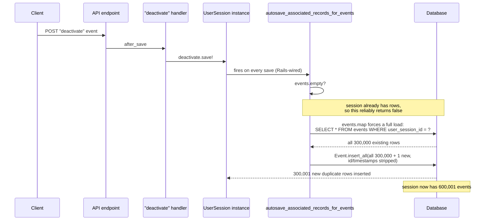
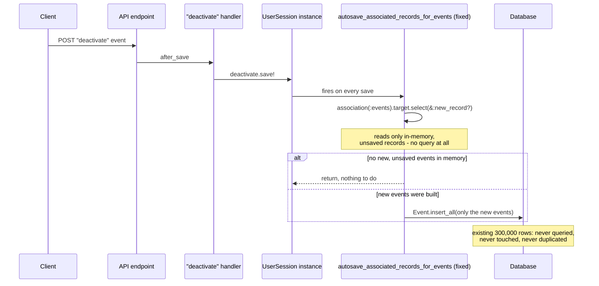

# The callback that quietly doubled our database

<audio controls preload="metadata" src="/assets/audio/2026-06-28-the-callback-that-duplicated-a-database-summary.ogg">
  Your browser does not support the audio element.
</audio>

A few weeks ago someone on our team went looking for a memory spike. They
found a much bigger story: a two-year-old bug that had been silently
duplicating rows in our database every time a particular API endpoint got
called, and a user session that had grown from a normal handful of events
to roughly 600,000 rows without anyone noticing.

This is the story of how we found it, why it took two years to surface, and
what it taught us about a very sharp corner of Rails that we suspect a lot
of teams are standing near without knowing it.

## The symptom

We track user activity as a stream of small events:
"started this activity," "answered this question," "finished this section,"
and so on. Each event is a row in an `events` table, tied to a
`user_session`. It is about as simple a write path as an API gets: a
client posts one event, we save one row.

Someone was profiling that endpoint and noticed a request that allocated
far more memory than a single-row insert has any business allocating. Not
a slow query. Not an N+1. A genuinely large, one-shot allocation on what
should have been one of the cheapest calls in the system.

Pulling on that thread led to the actual cause: the user session behind
that request had roughly 600,000 rows in its event history. A normal
session has dozens, maybe a few hundred. Something had been growing this
one for a long time.

## The obvious suspect, and why it wasn't

We had just finished a fairly large refactor two days earlier: ripping out
an older JSON:API resource library in favor of a lighter serializer, and
touching most of the controllers and event-handling code along the way.
It's an extremely natural first guess when something breaks two days after
you touched the exact code path in question. It was also wrong, and it was
worth being precise about *why* it was wrong before writing anything down
as a root cause.

We traced the specific line that ends up saving the user session (a
"deactivate" event, sent whenever a user finishes a session) back through
git history. The line itself, `user_session.deactivate.save!`, existed
almost word for word in a handler class from nearly a decade earlier, long
before the recent refactor. The refactor had moved it into a new file and
changed how it was dispatched, but the actual call was untouched. We also
confirmed, by reading the exact Rails internals involved, that the bug
doesn't even depend on how an event gets attached to its session in
memory. It fires purely because the session already has rows in the
database, regardless of what the request itself is doing.

The recent refactor didn't cause this. What it almost certainly did was put
fresh eyes and a profiler on an endpoint nobody had looked closely at in a
long time, which is probably *how* a two-year-old bug finally got noticed.
That distinction mattered: chasing the wrong two-day-old change would have
sent us nowhere, while the real defect kept quietly running in production.

## Down to the metal

The actual model code looked completely reasonable at a glance:

```ruby
class UserSession < ApplicationRecord
  has_many :events
  accepts_nested_attributes_for :events

  def autosave_associated_records_for_events
    return if events.empty?

    Event.insert_all events.map { |event|
      event.attributes.except('id', 'created_at', 'updated_at').merge(user_session_id: id)
    }
  end
end
```

This was added a couple of years earlier as a targeted performance fix.
When you build a brand-new `UserSession` with a batch of nested events
in one go (`UserSession.new(events_attributes: [...])`), Rails will, by
default, save each nested event with its own individual `INSERT`. For a
handful of records that's fine. Someone noticed it and wrote a faster path:
grab all the built events and insert them in a single bulk statement.
There was even a test proving it worked, for exactly that scenario: a new
session, a handful of nested events, one batch insert. It passed. It
shipped. It was correct, for the case it was tested against.

The name of that method is the whole story: `autosave_associated_records_for_events`
is not a name this codebase invented. It's the exact name Rails itself
generates and wires up as a save callback whenever you use
`accepts_nested_attributes_for`. Defining a method with that name doesn't
add a new callback; it **replaces** the one Rails already registered, for
every future save of that model, forever, not just for the one case you
had in mind when you wrote it.

Rails' own version of this method is careful. It only ever touches records
that are new, changed, or explicitly marked for destruction. That
carefulness is exactly what got thrown away.

## The reveal

Here's what actually happens when a normal "deactivate" event comes in for
a session that already has a long history:

1. The session gets saved (`user_session.deactivate.save!`), which is a
   completely ordinary, once-per-session operation.
2. That save triggers `autosave_associated_records_for_events`, because
   Rails wired it up to fire on every save, not just the create-with-nested-attributes
   case it was written for.
3. The method checks `events.empty?`. Because the session already has
   rows in the database, this reliably comes back `false`, even though
   nothing new was necessarily built in memory.
4. So it proceeds to `events.map`. This is the part that matters most:
   calling almost any enumerable method on an association that hasn't been
   loaded yet forces Rails to run the full query behind it, `SELECT * FROM
   events WHERE user_session_id = ?`, with no limit, no filter for "just
   the new ones." Every single row for that session gets pulled into memory.
5. `Event.insert_all` then takes *all* of those rows, strips their `id`
   and timestamps, and inserts them again as brand-new rows.

Laid out as a sequence, step 3 and step 4 are where it goes wrong: an
`empty?` check that's correct in isolation, followed by an enumeration that
silently turns into a full table scan because nothing upstream of it ever
loaded the association on purpose.



Every single "deactivate" event on an existing session was quietly copying
that session's *entire* history and reinserting it as duplicates. Not
updating anything. Not deduplicating anything. Just doubling it.

Do that once and a 50-row session becomes 100. Do it on every subsequent
deactivate/reactivate cycle and the growth compounds:

```
cycle  1:      50 →     100
cycle  2:     100 →     200
cycle  3:     200 →     400
cycle  4:     400 →     800
   ...
cycle 10:  12,800 →  25,600
   ...
cycle 14: 204,800 → 409,600
cycle 15: 409,600 → 819,200   ← comfortably past the 600,000 we found
```

It takes surprisingly few cycles of ordinary, entirely legitimate user
behavior to walk a session from a normal size to 600,000 rows. Exponential
growth is deceptive that way: it looks like nothing is wrong for a long
time, and then very suddenly it looks like everything is wrong.

## Why nobody caught it for two years

Three things lined up to hide this for so long:

- **The test that shipped with the fix only covered the scenario it was
  designed for**: a new session, freshly built nested events. It never
  saved an *existing* session that already had history, which is the only
  condition that triggers the bug. Passing tests gave real, but incomplete,
  confidence.
- **The cost is proportional to how much history already exists.** In
  development, staging, and most of production, sessions are small, so the
  bug is nearly free: doubling three rows is invisible. The exact same code
  path becomes a five- or six-figure allocation only once a session has
  been through enough cycles to accumulate real size. Bugs that scale with
  data size are notoriously good at hiding until the data catches up with
  them.
- **The side effects were confined to one table.** The duplicate rows were
  inserted via a raw bulk `INSERT`, which bypasses ActiveRecord callbacks
  entirely. Anything downstream that depends on those callbacks firing
  (creating related records, updating aggregates elsewhere) never
  duplicated. Only code that reads the raw event history directly would
  have seen anything wrong, and not much of our code does that.

## The fix

The actual fix is almost embarrassingly small once you see it. Instead of
operating on the full, potentially-huge collection, operate on only the
records that are genuinely new and unsaved:

```ruby
def autosave_associated_records_for_events
  new_events = association(:events).target.select(&:new_record?)
  return if new_events.empty?

  Event.insert_all new_events.map { |event|
    event.attributes.except('id', 'created_at', 'updated_at').merge(user_session_id: id)
  }
end
```

`association(:events).target` reads whatever is already sitting in
memory on that association without ever querying the database for existing
rows. Filtering to `new_record?` means only events that were just built
and never saved get included. Existing, persisted rows are never touched,
never loaded, and never duplicated. The original use case, a new session
created with a batch of nested events, still works exactly as before,
because those events are all new records sitting in memory. Nothing else
changes.

The same sequence as before, with the one-line fix in place. The database
never sees the existing 300,000 rows at all:



We also added a hard cap on events per session as a second layer of
protection: even with the root cause fixed, unbounded growth from some
future bug or a misbehaving client is cheap to guard against and expensive
to discover after the fact.

## The harder problem: the data doesn't fix itself

Shipping the code fix stops new duplication. It does nothing about the
duplicates already sitting in the database from two years of this quietly
running. That turned out to be the more interesting cleanup problem.

The key insight is that a duplicate row is not "similar" to another row,
it's identical, byte for byte, in every column except `id` and the
timestamps. That's exactly what the buggy insert produced: the same
attributes, minus the primary key. So the cleanup is a straightforward
fingerprint match: group each session's events by every column except
`id`/`created_at`/`updated_at`, and any group with more than one row is a
set of duplicates. Keep the row with the earliest timestamp (the real
original), drop the rest.

A tempting shortcut would have been to dedupe on a natural-looking unique
identifier the client sends with each event. It doesn't hold up: several
event types never set that identifier at all, and two genuinely distinct
events with no identifier set would incorrectly look like duplicates of
each other under that scheme. The full-column fingerprint is more work to
write but it's the one that actually matches what the bug produced,
nothing more and nothing less.

We wrote this as a two-step, reversible-by-design cleanup: a report task
that finds and counts duplicate groups without touching anything, reviewed
and spot-checked first, and a second task that actually removes them, one
session and one transaction at a time, guarded behind an explicit
confirmation flag. Deleting data is the one step in an incident response
that should never be a single-command reflex.

## Lessons learned

A few things feel true beyond this one bug:

**Don't redefine a framework-generated callback name unless you're willing
to reimplement its safety guarantees.** Rails names like
`autosave_associated_records_for_<association>` aren't just convenient
hooks, they're load-bearing. Overriding one silently discards whatever
careful, general-purpose logic Rails had there for every future caller,
not just the one you're thinking about right now. If you need custom
behavior, put it behind a name of your own that's only invoked from
exactly where you intend it.

**Calling an enumerable method on an unloaded association loads the whole
thing.** `.map`, `.each`, `.to_a`, `.sum`: any of them, called on a
`has_many` you haven't already loaded, will fetch every matching row, even
if you only wanted the two you just built. If you specifically want the
in-memory, unsaved records on an association, go through the association
object's raw target and filter explicitly. Don't reach for the collection
proxy and assume it only has what you put there.

**A test that proves your intended case works is not a test that your
change is safe.** The regression test for this fix was thorough for the
one scenario it covered and silent about everything else that shares the
same code path. When you're changing something shared, like a callback
that fires on every save, the more valuable test asks "what else calls
this, and does it still behave correctly," not just "does my new case
pass."

**Bugs that scale with data size buy themselves time.** This one was
inexpensive right up until it wasn't. If you're touching code whose cost
depends on how much data already exists, it's worth explicitly testing the
large-data case, not just the empty and small ones, because production is
the only place where "large" reliably happens, and by the time it does,
the bug has had a long time to compound.

## How to prevent this from happening again

A retrospective that ends at "here's what we learned" only helps the
people who read it, and only for as long as they remember it. The more
durable fix is to turn each lesson above into something that fires on its
own, without depending on anyone's memory:

- **Lint against the pattern, not just this instance.** Rails' generated
  callback names follow a fixed, greppable convention:
  `autosave_associated_records_for_<association>`,
  `before_add_for_<association>`, `validate_associated_records_for_<association>`,
  and a handful of others. A custom static-analysis rule that flags any
  method definition matching that shape, and asks "are you sure you want to
  replace Rails' version of this, not just add to it," turns a subtle trap
  into a loud one at review time.
- **Require a "pre-existing parent" test for anything touching a shared
  callback.** If a change affects a method that fires on every save of a
  model (not just the one path you're optimizing), the test suite should
  be required to include a case that saves an *existing* record with
  *existing* related data, not only a freshly created one. That single test
  shape would have caught this two years ago.
- **Add a large-collection test tier for associations that grow with user
  activity.** Empty and small-N cases prove correctness. They don't prove
  anything about cost. Any association that can plausibly grow into the
  thousands deserves at least one test that builds it out to a
  meaningfully large size and asserts the operation under test doesn't
  scale linearly (or worse) with it.
- **Watch row-count growth per parent, not just table size.** A dashboard
  or scheduled check that flags any single parent record whose child-row
  count crosses an unusual threshold, or grows unusually fast between
  checks, would have surfaced this specific session organically, likely
  months before anyone went looking for a memory spike.
- **Keep the defense-in-depth cap even after fixing the root cause.** We
  added a hard limit on events per session alongside the real fix, on
  purpose. It doesn't matter *why* something might grow unboundedly in the
  future; a cheap ceiling means the next cause of unbounded growth is a
  bounded problem instead of another multi-year surprise.
- **Consider a database-level backstop.** Where a natural uniqueness
  constraint exists (even a partial one, "unique where present"), enforcing
  it at the database level means a future regression fails loudly with a
  constraint violation instead of succeeding silently and duplicating data
  for two years.

## Where AI tooling fits in

Worth saying plainly: the investigation behind this whole story was done
with an AI coding assistant doing the debugging, not just us describing a
hypothesis and asking it to write the fix. That distinction is the
interesting part. The tool didn't accept "this looks like it's probably the
recent refactor" and move on. It pulled the actual installed Rails source
for the exact methods involved, `CollectionProxy#records`,
`Association#target`, the callback-registration code in
`add_autosave_association_callbacks`, and confirmed the mechanism against
that source before proposing anything. Then it wrote a test that
reproduced the duplication and watched it fail for the right reason before
touching the model code. That's the same discipline good engineers already
practice; the value was in it being non-negotiable rather than something
to skip when the deadline is close.

That suggests a concrete way to fold this incident back into prevention,
rather than just writing it down:

- **Give AI code review the specific pattern, not just general vigilance.**
  A generic "review this PR for bugs" prompt is unlikely to catch a
  framework-specific footgun like callback-name shadowing. A prompt that
  explicitly says "flag any method definition matching a Rails-generated
  callback name, and check whether a pre-existing-parent test case exists"
  turns institutional scar tissue into a repeatable check that runs on
  every PR, not just the ones a senior engineer happens to review closely.
- **Same treatment for the "enumerable forces a full load" gotcha.** An AI
  reviewer with the right context can be prompted to flag `.map` / `.each`
  / `.to_a` / `.sum` on a `has_many` association inside code reachable from
  a hot path, and ask whether that association is guaranteed to stay
  small, or whether it should be scoped, preloaded, or paginated instead.
  This is exactly the kind of thing that's easy to know in the abstract and
  easy to miss in a 40-line diff.
- **Use AI-assisted investigation to shorten the loop from symptom to root
  cause.** The most expensive part of an incident like this is usually not
  the fix, it's the time spent chasing plausible-but-wrong theories (the
  recent refactor, in our case) before someone reads the actual framework
  internals. An assistant that treats "read the real source before
  concluding" as a hard requirement, not a nice-to-have, compresses that
  time meaningfully.
- **Feed resolved incidents back in as review context**, not just as
  documentation. A postmortem that only lives in a docs folder helps the
  people who happen to read it. The same postmortem, turned into a rule an
  AI reviewer checks on every relevant PR, helps everyone who touches that
  code afterward, including people who never read the original incident at
  all.

None of this replaces reading the framework source when something doesn't
add up, and none of it replaces a human deciding whether a flagged pattern
is actually a problem in context. What it changes is the default: a lesson
like this one stops being something you hope the next engineer remembers,
and becomes something the tooling checks for them.
