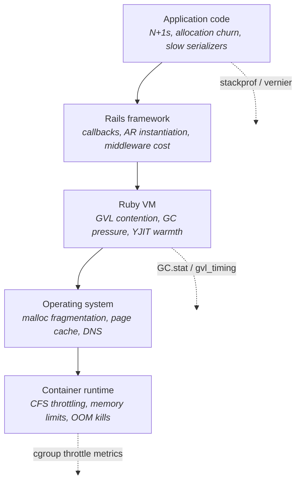
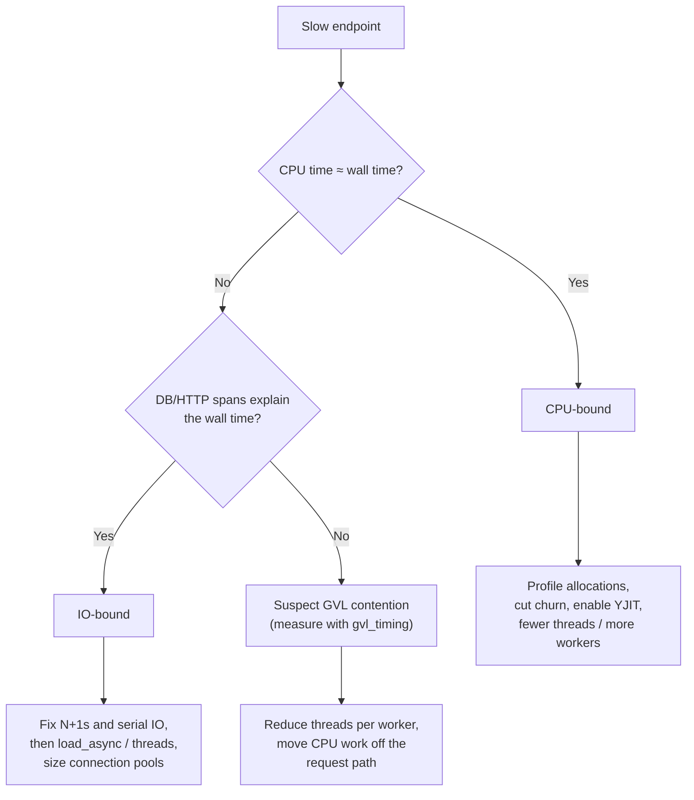

# Rails Performance from the Metal Up: A Field Guide

<audio controls preload="metadata" src="/assets/audio/2026-07-19-rails-performance-from-the-metal-up-field-guide-summary.ogg">
  Your browser does not support the audio element.
</audio>

Most Rails performance advice fails for the same reason: it prescribes a fix before establishing a diagnosis. Someone reads that threads are good, cranks Puma to 16 threads per worker, and watches p99 latency get worse. Someone else reads that caching solves everything, wraps a CPU-bound serializer in Redis, and now has a slow endpoint plus a cache invalidation problem. I know both of these failure modes intimately because I have shipped both of them. The 16-thread config lived in production for months before anyone thought to question it.

A Rails request travels through at least five layers that each have their own performance characteristics: your application code, the Rails framework, the Ruby VM, the operating system, and (these days, almost always) a container runtime with resource limits. A fix that is correct at one layer is frequently harmful at another. More threads help an IO-bound app and hurt a CPU-bound one. A bigger heap reduces GC frequency and increases OOM risk under a cgroup memory limit. What follows is the mental model I wish someone had handed me ten years ago, plus the tools that tell you the truth at each layer.



*Every request crosses all five layers. Each layer has its own failure modes and its own truth-telling tools; a fix aimed at the wrong layer is at best wasted and at worst harmful.*

I am going to assume you are running a reasonably modern stack: Ruby 3.2+, Rails 7+, Puma, Postgres or MySQL, deployed in containers on something like Kubernetes. Most of it applies elsewhere with minor translation.

## Step zero: is it CPU or IO?

Everything downstream depends on this question, and it is the one people most often skip. The two failure modes want opposite medicine.

An IO-bound request spends its wall time waiting: on the database, on Redis, on an external HTTP API, on disk. While a Ruby thread waits on IO, it releases the Global VM Lock (GVL), so other threads can run. IO-bound workloads want concurrency: more threads, concurrent queries, connection pools sized to match.

A CPU-bound request spends its wall time executing Ruby: serializing JSON, instantiating ActiveRecord objects, running business logic, and, very often, garbage collecting the debris of all three. CPU-bound workloads want the opposite: fewer threads (to avoid GVL contention), faster code, fewer allocations, and more processes if you need parallelism.

|  | IO-bound | CPU-bound |
|---|---|---|
| **Where the time goes** | Waiting: DB, Redis, HTTP, disk | Executing Ruby: serialization, AR instantiation, GC |
| **Telltale signal** | Wall time >> CPU time; fat DB/HTTP spans in APM | CPU time ≈ wall time; thin spans, unexplained gaps |
| **What helps** | More threads, `load_async`, fixing serial IO, pool sizing | Fewer threads, more workers, allocation reduction, YJIT |
| **What hurts** | Undersized connection pools, serial N+1 queries | High thread counts (GVL contention), tight CPU limits |
| **First tool to reach for** | APM trace waterfall, `stackprof :wall` | `stackprof :cpu` / vernier, `memory_profiler`, `GC.stat` |

The cheapest way to tell them apart is to measure CPU time against wall time for the same request:

```ruby
# Rack middleware, or an around_action in a controller
wall_start = Process.clock_gettime(Process::CLOCK_MONOTONIC)
cpu_start  = Process.clock_gettime(Process::CLOCK_PROCESS_CPUTIME_ID)

response = @app.call(env)

wall = Process.clock_gettime(Process::CLOCK_MONOTONIC) - wall_start
cpu  = Process.clock_gettime(Process::CLOCK_PROCESS_CPUTIME_ID) - cpu_start
Rails.logger.info("wall=#{(wall * 1000).round(1)}ms cpu=#{(cpu * 1000).round(1)}ms")
```

If CPU time is close to wall time, you are CPU-bound. If wall time dwarfs CPU time, you are waiting on something, and your APM traces will usually tell you what. One honest caveat: `CLOCK_PROCESS_CPUTIME_ID` measures the whole process, so in a multi-threaded server it includes the other threads' work. Use `CLOCK_THREAD_CPUTIME_ID` for per-request precision, or just treat the number as directional, which is usually all you need at this stage.

There is a third category that masquerades as IO wait but is really a CPU symptom: GVL contention. If your APM shows a request that took 400ms but the sum of its DB and HTTP spans is 80ms and its CPU time is 60ms, the missing 260ms was probably spent queued behind other threads waiting for the GVL. Ruby 3.2 added a GVL instrumentation API, and the `gvl_timing` and `gvl-tracing` gems expose it. The first time I measured this on a busy ingestion endpoint, GVL wait was a third of p95 latency, on a service everyone had assumed was database-bound. Nobody believed the number until we cut threads from 5 to 2 and watched p95 drop by almost exactly that amount. If you run one experiment from this article, make it this one.

The profiler complements the clock. `stackprof` in `:wall` mode shows you where elapsed time goes, including IO waits; `:cpu` mode shows only on-CPU samples. Run both against the same workload and compare. `vernier` is the newer generation of the same idea, with better multi-thread support, GVL awareness, and GC visibility, and its output loads into the Firefox Profiler UI. For production, continuous profilers (Datadog's, or Pyroscope) let you answer "what changed" after a bad deploy without reproducing anything locally.

The whole diagnosis fits in one decision tree:



Once you know which side of the line you are on, the rest of this article splits accordingly. But first we need to talk about the machine your code actually runs on: the Ruby VM.

## The VM layer: GVL, GC, and YJIT

CRuby executes one thread's Ruby code at a time per process. That is the GVL. It is not a design flaw you can configure away; it is the concurrency model. The practical consequences:

Threads give you IO concurrency, not CPU parallelism. Ten threads can all be waiting on Postgres simultaneously, but only one can be building a JSON response at any instant. If two threads both have CPU work, they take turns, and the turn-taking itself has a cost: the thread quantum is 100ms by default, so a latency-sensitive request can stall behind another thread's CPU burst for up to 100ms at a time. This is why p99 latency degrades as you add threads to a CPU-heavy service even while average throughput looks flat.

Processes give you real parallelism, because each has its own GVL. The trade is memory, which we will get to.

```mermaid
gantt
    dateFormat X
    axisFormat %L ms
    title One Puma worker, three threads: only one holds the GVL at a time
    section Thread A
    CPU (holds GVL)      :a1, 0, 40
    waits on Postgres    :done, a2, 40, 90
    CPU (waits for GVL, then runs) :crit, a3, 90, 150
    section Thread B
    waits for GVL        :crit, b1, 0, 40
    CPU (holds GVL)      :b2, 40, 100
    waits on Redis       :done, b3, 100, 150
    section Thread C
    waits on HTTP call   :done, c1, 0, 100
    waits for GVL        :crit, c2, 100, 110
    CPU (holds GVL)      :c3, 110, 150
```



*IO waits (grey) overlap freely; CPU sections cannot. The red "waits for GVL" slices are pure queueing latency that shows up in no APM span, and they grow with every thread you add to a CPU-heavy worker.*

The second VM concern is the garbage collector, and here is the reframe that changes how you optimize: in a typical Rails app, GC is not a background nuisance, it is a meaningful fraction of your CPU time, and it is proportional to how much garbage you create. A request that allocates 500,000 objects does not just pay for the allocations; it pays for the GC minor marks that sweep them up, and it pushes survivors into the old generation where major GCs get more expensive. Allocation reduction is CPU optimization.

CRuby's GC is generational (young objects are collected cheaply and frequently, old objects rarely) and incremental (major marks are sliced to bound pause times). Ruby 3.3 and 4.0 have continued improving it, and 3.3 shipped an optional pure-mark-and-sweep mode plus better heap tuning knobs. But tuning `RUBY_GC_*` environment variables is the last move, not the first. The first move is measurement:

```ruby
before = GC.stat
work
after = GC.stat
puts "minor GCs: #{after[:minor_gc_count] - before[:minor_gc_count]}"
puts "major GCs: #{after[:major_gc_count] - before[:major_gc_count]}"
puts "objects allocated: #{after[:total_allocated_objects] - before[:total_allocated_objects]}"
```

Wrap that around a representative request in a console, or export `GC.stat` counters as runtime metrics and watch allocations-per-request as a first-class dashboard number. When it jumps after a deploy, you know exactly which PR to read.

The third VM lever is YJIT, and it is the closest thing to free performance the Ruby ecosystem has ever shipped. Enable it (`RUBY_YJIT_ENABLE=1`, or `--yjit`) and measure; 15 to 30 percent latency improvement on real Rails workloads is common, with serialization-heavy code often at the top of that range. A couple of things worth knowing before you flip it on. YJIT compiles methods as they warm up, so give it executable memory headroom (`--yjit-exec-mem-size`, though the default is fine for most apps) and expect a modest RSS increase per process. Also, YJIT gains compound with allocation reduction: JIT-compiled code that still spends a third of its time in GC is leaving the win on the table, which is a nice segue into the next section.

## Memory: churn versus residency

Memory problems come in two distinct flavors that people constantly conflate.

Allocation churn is the rate at which you create short-lived objects. Its cost is CPU (GC time), and it shows up as slow requests. Residency (RSS) is how much memory each process holds. Its cost is density: how many Puma workers fit on a node before the OOM killer starts making deployment decisions for you.

| | Allocation churn | Residency (RSS) |
|---|---|---|
| **What it is** | Rate of short-lived object creation | Memory each process holds long-term |
| **What it costs you** | CPU time in GC, slower requests | Fewer workers per node, OOM risk |
| **How to measure** | `memory_profiler`, `GC.stat` allocation deltas | Process RSS over time, container memory metrics |
| **Main fixes** | `pluck`/`select`/`insert_all`, faster serializers, frozen strings | jemalloc or `MALLOC_ARENA_MAX=2`, `preload_app!` + CoW, worker recycling |
| **Common misdiagnosis** | Blamed on "Ruby being slow" | Blamed on a leak when it is fragmentation |

### Churn

Profile first. `memory_profiler` gives you allocation counts and bytes by gem, file, and line for a block of code:

```ruby
require "memory_profiler"
report = MemoryProfiler.report do
  ActiveRecord::Base.connection_pool.with_connection do
    Api::V3::CommandSerializer.render(commands)
  end
end
report.pretty_print(scale_bytes: true, top: 20)
```

Run it on your hottest endpoint and the top of the list is usually embarrassing in a productive way: an `as_json` round-trip that builds a deep intermediate hash before serializing it, a scope that instantiates ten thousand ActiveRecord objects to read one column from each, a logging call that formats a string nobody reads.

Here is a real shape of fix, anonymized from an events endpoint I worked on. The original code looked completely innocent:

```ruby
# Before: ~210,000 allocations per request at 2,000 events
def index
  commands = @session.session_commands
                     .order(:sequence)
                     .map { |c| c.as_json(only: %i[id kind payload occurred_at]) }
  render json: { session_id: @session.id, commands: commands }
end
```

Every command becomes a full ActiveRecord object (all columns loaded, all attribute objects built), then `as_json` converts each one into an intermediate hash, then `render json:` serializes the hash array into a string. Three representations of the same data, two of which exist only to be garbage collected.

```ruby
# After: ~9,000 allocations per request for the same payload
def index
  rows = @session.session_commands
                 .order(:sequence)
                 .pluck(:id, :kind, :payload, :occurred_at)

  json = Oj.dump(
    {
      session_id: @session.id,
      commands: rows.map { |id, kind, payload, at|
        { id: id, kind: kind, payload: payload, occurred_at: at }
      }
    },
    mode: :rails
  )
  render json: json
end
```

`pluck` skips ActiveRecord instantiation entirely and Oj writes the string directly. Same response body, roughly 95 percent fewer allocations, and p50 on that endpoint dropped from 180ms to 45ms with no configuration change anywhere. The lesson I took from it: the fastest object is the one you never create.

The rest of the churn playbook follows the same instinct. `select` narrows columns so the objects you do instantiate are lighter. `find_each` and `in_batches` bound how many exist at once. `insert_all`/`upsert_all` skip instantiation on the write path. `# frozen_string_literal: true` everywhere, enforced by RuboCop, so string literals stop allocating per call. In hot loops, `<<` instead of `+=`, and hoist invariant objects out. None of this matters in cold code. All of it matters in the three endpoints that take 80 percent of your traffic, and nowhere else, so resist the urge to golf the whole codebase.

### Residency

RSS in long-running Ruby processes grows for three reasons: genuine leaks (rare), a heap that grew to serve a spike and never shrinks (common, and mostly fine), and allocator fragmentation (common, fixable, and the one nobody suspects).

Fragmentation is a glibc malloc behavior: in multi-threaded processes it creates per-thread memory arenas, and Ruby's allocation pattern scatters long-lived objects across them so pages can never be returned to the OS. The fix is one line in your Dockerfile: install jemalloc and load it.

```dockerfile
RUN apt-get update && apt-get install -y libjemalloc2
ENV LD_PRELOAD=/usr/lib/x86_64-linux-gnu/libjemalloc.so.2
```

A 20 to 40 percent RSS reduction on threaded Puma workers is a normal result. If you cannot use jemalloc, `MALLOC_ARENA_MAX=2` recovers a good chunk of the same win by capping glibc's arenas.

The other residency lever is copy-on-write. Puma's `preload_app!` boots Rails once in the master process and forks workers from it, so workers share the loaded framework, gems, and YJIT code until they write to those pages. GC compaction (`GC.compact` after boot, or autocompaction) can improve sharing further by defragmenting the heap before forking, though measure it: compaction has had sharp edges across Ruby versions, and the win depends on your heap shape.

## IO and concurrency: threads, fibers, and the case for batching

Because the GVL releases during IO, plain threads already give Rails apps IO concurrency. The question is how much concurrency you need and what it costs.

For most CRUD apps, the answer is "a little": a handful of Puma threads per worker covers the DB waits, and the interesting optimization is making the IO itself faster and less serial. N+1 queries are serial IO, which is why they are so much worse than their row counts suggest: fifty 2ms queries is 100ms of wall time plus fifty round-trip latencies, where one 8ms query would do. Fix N+1s (`includes`, `preload`, strict loading in development to catch regressions) before reaching for concurrency machinery.

When a single request genuinely needs several independent queries, ActiveRecord's `load_async` runs them concurrently on a background thread pool:

```ruby
sessions  = LessonSession.where(learner_id: id).load_async
commands  = SessionCommand.recent.load_async
summary   = build_summary(sessions.to_a, commands.to_a) # blocks until both resolve
```

Three 30ms queries become roughly 30ms instead of 90ms. Remember that the async executor uses its own database connections; size your pool for Puma threads plus the async pool or you will trade query latency for connection-checkout latency.

Fiber-based async (the `async` gem, the Falcon server, `config.active_support.isolation_level = :fiber`) changes the concurrency unit from a heavyweight thread to a cheap fiber, which matters when you need thousands of concurrent IO waits: long-polling, streaming, websocket fan-out, or fan-out to many slow external APIs. For a conventional request/response app on Puma it is mostly a lateral move. Adopt it for a workload shape, not as a general speedup.

And for high-throughput write paths specifically, the strongest move is often to reduce concurrency rather than increase it: batch. Accumulating events and writing them with one `insert_all` of 500 rows beats 500 individual inserts on every axis at once: one round trip instead of 500, one transaction, a fraction of the allocations, no per-row callback and validation overhead, and far less connection pool pressure. An ingestion endpoint that enqueues raw payloads cheaply and lets a background consumer batch them into Postgres will outperform almost any amount of per-request tuning.

| Cost, per 500 events | 500 individual `create` calls | One `insert_all` of 500 rows |
|---|---|---|
| **DB round trips** | 500 | 1 |
| **Transactions** | 500 | 1 |
| **AR objects instantiated** | 500+ (plus callbacks, validations) | 0 |
| **Connection pool checkouts** | 500 | 1 |
| **GVL / GC pressure** | High: allocations per row | Low: one array of hashes |
| **Trade-off** | Callbacks and validations run | You own validation and side effects yourself |

The shape I keep reaching for on ingestion paths: the request handler does almost nothing (validate the envelope, push the raw payload onto a buffer, return 202), and a consumer drains the buffer in batches:

```ruby
# The endpoint stays skinny: no AR, no callbacks, single Redis op
def create
  payload = request.raw_post
  return head :unprocessable_entity unless valid_envelope?(payload)

  REDIS.rpush("ingest:commands", payload)
  head :accepted
end
```

```ruby
# A recurring job (GoodJob cron, Sidekiq scheduler, whatever you run)
class DrainCommandBufferJob < ApplicationJob
  BATCH = 500

  def perform
    loop do
      raw = REDIS.lpop("ingest:commands", BATCH)
      break if raw.blank?

      rows = raw.filter_map do |json|
        event = JSON.parse(json)
        next unless event["session_id"] # cheap validation, dead-letter the rest

        {
          lesson_session_id: event["session_id"],
          kind:              event["kind"],
          payload:           event["payload"],
          occurred_at:       event["occurred_at"]
        }
      end

      SessionCommand.insert_all(rows, record_timestamps: true) if rows.any?
    end
  end
end
```

Yes, you give up per-row callbacks and model validations, and you take on at-least-once delivery semantics (make the insert idempotent with a unique index and `unique_by:` if duplicates matter). In exchange, the write path stops being a performance problem at all. I have watched this pattern take an endpoint from falling over at 300 requests per second to shrugging at 3,000, on the same hardware, and the diff was smaller than this article.

## Threads and processes: shaping the runtime

With the diagnosis and the VM model in hand, Puma sizing stops being folklore.

Workers (processes) buy CPU parallelism. Start at one worker per core available to the container and adjust from measurement. With `preload_app!` and jemalloc, the marginal memory cost of a worker is much lower than its RSS suggests, because of copy-on-write sharing.

Threads buy IO concurrency inside each worker, at the price of GVL contention and per-thread memory arenas. Rails' default dropped to three threads per worker in 7.2 for good reason: production data across many apps showed higher counts trading p99 latency for throughput gains that mostly were not there. My working rule: heavily IO-bound services can justify five; mixed workloads sit at three; CPU-bound endpoints (heavy serialization, ingestion parsing) want two or even one, with parallelism coming from workers instead.

| Workload shape | Workers | Threads/worker | Rationale |
|---|---|---|---|
| Mixed CRUD (typical Rails) | ~1 per core | 3 | Rails 7.2 default; balances throughput and p99 |
| Heavily IO-bound (API gateway, webhook fan-out) | ~1 per core | 5 | Threads overlap IO waits cheaply |
| CPU-bound (serialization-heavy, ingestion parsing) | 1 per core, or slightly above | 1–2 | Parallelism from processes; avoids GVL queueing |
| Massive concurrent IO (streaming, long-poll) | few | fibers (Falcon/async) | Thread-per-request stops scaling; change the model |

Put together, a production `puma.rb` for a mixed workload ends up looking something like this:

```ruby
# config/puma.rb
workers ENV.fetch("WEB_CONCURRENCY") { 4 }   # ~1 per core in the container
threads_count = ENV.fetch("RAILS_MAX_THREADS") { 3 }.to_i
threads threads_count, threads_count          # min == max; elastic pools hide problems

preload_app!                                  # boot once, fork workers, share via CoW

before_fork do
  # Nothing DB-related should survive the fork
  ActiveRecord::Base.connection_pool.disconnect!
end

worker_check_interval 5
worker_timeout 30                             # a stuck worker is worse than a killed one
```

Setting min and max threads equal is a small opinion I will defend: an elastic pool that grows under load means your connection math is only true sometimes, and "sometimes" is always 2am.

Speaking of connection math, this is the part people skip and then pay for. Database pool size must cover every thread that can want a connection: Puma threads, plus the `load_async` executor, plus anything else you spawn. Then your Postgres `max_connections` must cover pool size times workers times pods, which is usually the moment PgBouncer enters the conversation, slightly later than it should have.

Background jobs follow the same physics. Sidekiq's threaded model is superb for IO-heavy jobs (mailers, webhooks, API syncs) and mediocre for CPU-heavy ones, where 10 threads crunching data take turns on one GVL. Route CPU-heavy jobs to a dedicated process pool with low concurrency, or to GoodJob/Solid Queue processes shaped the same way, so a burst of heavy jobs cannot starve the latency-sensitive queue.

## The OS and container layer: where good configs go to die

Everything above happens inside a box drawn by cgroups, and the box has sharp walls.

CPU limits on Kubernetes are enforced by CFS quota: a limit of `1` means 100ms of CPU time per 100ms period, and when you exhaust the quota, every thread in the container freezes until the next period. Ruby is unusually sensitive to this. GC pauses and YJIT compilation create CPU bursts, a multi-threaded Puma can burn a whole quota slice in a spike, and the resulting throttle shows up in your APM as unexplained 50 to 100ms latency stripes that correlate with nothing in your code. I lost most of a week to this once, convinced we had a lock somewhere, before someone finally graphed `container_cpu_cfs_throttled_periods_total` next to the latency chart and the two lines were the same line. The pod averaged 30 percent CPU the entire time. Believe the throttling metric, not the average. The usual fixes: set CPU requests honestly, then either drop limits where policy allows, set them generously above request, or use static CPU management for the workloads that matter.

Memory limits interact with everything in the residency section. The kernel OOM killer does not send a polite signal; it kills the process mid-request. Leave real headroom between expected RSS (after jemalloc, after CoW) and the cgroup limit, and remember that a major GC or `GC.compact` can spike usage transiently. If workers grow slowly and unavoidably, a worker-recycling policy (puma_worker_killer or rolling restarts) is an honest operational patch while you hunt the growth. Not glamorous, but neither is being paged.

A couple of smaller OS gotchas that punch above their weight. Filesystem-backed caches and tmp directories inside containers can land on slow storage classes; keep hot temp IO on tmpfs or emptyDir where appropriate. And DNS resolution inside Kubernetes (ndots, search domains) can add milliseconds to every external HTTP call your app makes; if outbound calls are mysteriously slow before the TCP connect even starts, look there first.

## Tracking it: making performance a regression you can see

The difference between teams that stay fast and teams that get slow is rarely knowledge; it is feedback loops.

| Question | Tool | When to use it |
|---|---|---|
| Where does wall time go? | `stackprof :wall`, vernier, APM traces | First look at any slow endpoint |
| Where does CPU time go? | `stackprof :cpu`, vernier | After confirming CPU-bound |
| What is allocating? | `memory_profiler`, `allocation_stats` | CPU-bound with high GC counts |
| Is GC the problem? | `GC.stat` deltas, runtime metrics | Continuously, as a dashboard |
| Are threads fighting? | `gvl_timing`, `gvl-tracing`, GVL instrumentation API | Unexplained latency gaps in traces |
| Why is RSS growing? | jemalloc stats, `heap-profiler`, `derailed_benchmarks` | Memory alerts, OOM kills |
| Is the container throttled? | `container_cpu_cfs_throttled_periods_total` | Latency stripes uncorrelated with code |
| Which change was faster? | `benchmark-ips` | Micro-decisions, with production-sized data |
| What changed since Monday? | Continuous profiler (Datadog, Pyroscope) | Post-deploy regressions |

Instrument the runtime, not just the requests. Export GC stats (allocations, minor/major counts, heap slots), GVL wait time, thread pool utilization, and connection pool wait time as first-class metrics. Datadog's Ruby runtime metrics give you most of this for free; failing that, a tiny initializer is an afternoon of work that permanently answers "did this deploy get more expensive":

```ruby
# config/initializers/runtime_metrics.rb
Rails.application.config.after_initialize do
  Thread.new do
    loop do
      stat = GC.stat
      STATSD.gauge("ruby.gc.minor_count",     stat[:minor_gc_count])
      STATSD.gauge("ruby.gc.major_count",     stat[:major_gc_count])
      STATSD.gauge("ruby.gc.heap_live_slots", stat[:heap_live_slots])
      STATSD.gauge("ruby.gc.old_objects",     stat[:old_objects])
      sleep 10
    end
  end
end
```

Profile continuously in production. Sampling profilers are cheap enough to run always-on now. When p99 degrades on Tuesday, diffing Tuesday's flame graph against Monday's beats any amount of local reproduction.

When you are deciding between two implementations, `benchmark-ips` is the tool, because it gives you iterations per second with statistical confidence instead of a single noisy wall-time number:

```ruby
require "benchmark/ips"

commands = SessionCommand.limit(2_000).to_a

Benchmark.ips do |x|
  x.report("as_json map") do
    commands.map { |c| c.as_json(only: %i[id kind occurred_at]) }
  end

  x.report("pluck + hash") do
    SessionCommand.limit(2_000)
                  .pluck(:id, :kind, :occurred_at)
                  .map { |id, k, at| { id: id, kind: k, occurred_at: at } }
  end

  x.compare!
end
# pluck + hash:  142.3 i/s
#  as_json map:   11.7 i/s - 12.16x slower
```

That `12.16x slower` line has ended more architecture debates in my career than any document ever has. One discipline makes or breaks it, though: benchmark with production-sized data. Nearly every serialization and query disaster I have seen looked perfectly fine with 20 rows. For whole-app numbers, `derailed_benchmarks` covers memory and boot cost, and a small set of production-shaped load tests (k6, vegeta) covers the endpoints that pay the bills.

Finally, put a number on the goal before you start. "Make it faster" produces endless work; "p99 under 200ms at 2x current peak throughput within the current node budget" produces a finish line, and usually reveals that only one or two of the techniques in this article are actually needed.

## A closing workflow

When an endpoint is slow, the sequence that has served me best: measure wall versus CPU time to classify the problem. Profile with stackprof or vernier to find where the time actually goes, not where you assume it goes (these are different more often than is comfortable to admit). If CPU-bound, profile allocations and remove churn before touching any configuration. If IO-bound, fix serial IO before adding concurrency. Only then shape threads, workers, and container resources to match the workload you now understand. And leave behind the metrics that would have caught this regression automatically, because the next one is already in someone's open PR.

None of this is clever, and that is rather the point. Every genuinely painful performance incident I have been part of came from skipping a step in that sequence, usually the first one. Performance work done in order is boring, incremental, and extremely effective, which is exactly what you want from it.
